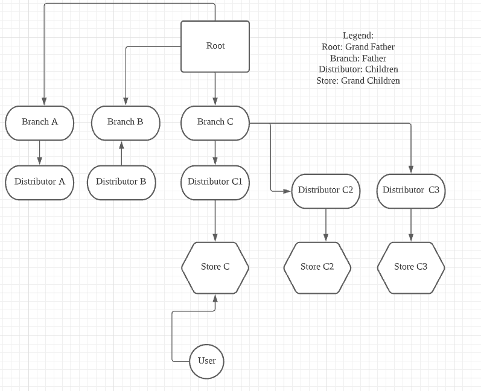

# Commission System

A quickstart guide to understanding our Commission System.

## Player's Uplines

Meaning which downline accounts should be the commission points be credited upon. Should consist of 1 Root, 1 Distributor, 1 Branch & 1 Store. Commission varies of either Betting or Winning. They both have different percentages when the points is distributed it really depends on the Downline Account's Percentages.

Winning & Betting has 2 types of games `Evolution & Pragmatic Play`:

- `Live Casino` right now only betting commission is only enabled.
- `Slot Games` are basically just 50/50 chance.

## Multi Level Marketing

To understand fully of the commission system and its hierachy here's a chart this is the Partner Management.

  

All of the calculations are rendered real time. 

## Workflow Betting Commission

1. User Bets
2. User Losses 
3. Bet amount will be commissioned to user's respective uplines (root, branch, distributor, store)
4. Total Commission points to downlines will be deducted from Operator Wallet

## Workflow Winning Commission

1. User Bets
2. User Wins 
3. Win amount will be commissioned to user's respective uplines (root, branch, distributor, store)
4. Total Commission points to downlines will be deducted from User Wallet

## Testing

All the necessary materials or resources is on the Inifnite Gamings sheet which will be provided to you by a Blueprint Dev.